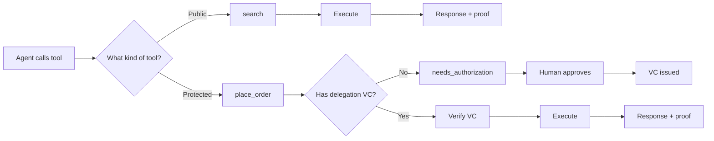
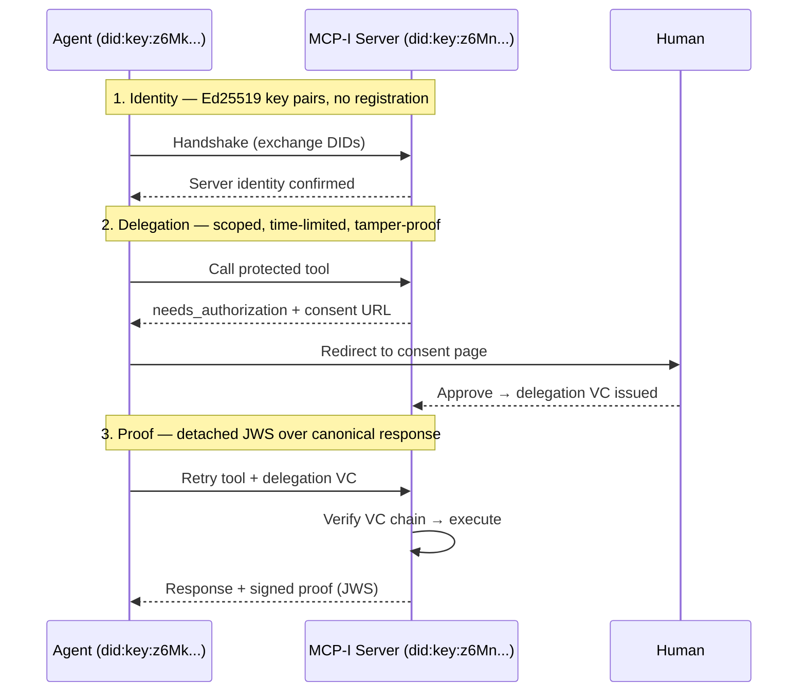

# @mcp-i/core — The missing trust layer for MCP

[](https://github.com/modelcontextprotocol-identity/mcp-i-core/actions/workflows/ci.yml)
[](https://www.npmjs.com/package/@mcp-i/core)
[](./LICENSE)
[](https://nodejs.org)
[](https://www.typescriptlang.org)

**Add identity, delegation, and cryptographic proofs to any MCP server.**

MCP gave AI agents a universal way to discover and use tools. But it didn't solve trust: there's no way for a server to verify who's connecting, no way for a client to verify the server is legitimate, and no audit trail when things go wrong.

`@mcp-i/core` adds the missing trust layer. Every tool call answers three questions:

| | Without MCP-I | With MCP-I |
|---|---|---|
| **Who is calling?** | Unknown — shared API key across all agents | Cryptographic identity via [DIDs](https://www.w3.org/TR/did-core/) (`did:key:z6Mk...`) |
| **Are they allowed?** | No way to tell — key has full access | Scoped [Verifiable Credential](https://www.w3.org/TR/vc-data-model-2.0/) from a human approver |
| **What happened?** | Logs show `API_KEY_PROD` made the call | Signed proof (JWS) — tamper-evident audit trail |
| **Revoke one agent?** | Rotate the key. Break everyone. | One call. No one else affected. |

No central authority. No shared API keys. The math proves it.

> **Open standard.** MCP-I is governed by the [DIF Trusted AI Agents Working Group](https://identity.foundation/working-groups/agent-and-authorization.html). Spec and docs: [modelcontextprotocol-identity.io](https://modelcontextprotocol-identity.io/introduction)

---

## Quick start

```bash
npm install @mcp-i/core
```

Two lines to add identity to an existing MCP server:

```typescript
import { McpServer } from "@modelcontextprotocol/sdk/server/mcp.js";
import { withMCPI, NodeCryptoProvider } from "@mcp-i/core";

const server = new McpServer({ name: "my-server", version: "1.0.0" });
await withMCPI(server, { crypto: new NodeCryptoProvider() });
```

That's it. Your server now has:

- A unique cryptographic identity (`did:key`) generated automatically
- A handshake endpoint agents can use to establish mutual trust
- Signed proofs attached to every tool response
- Session management with replay prevention

Register tools exactly like you normally would. MCP-I operates at the protocol layer -- your tool code doesn't change.

> **Full walkthrough:** The [Quick Start guide](https://modelcontextprotocol-identity.io/quickstart) covers install, first run, the consent flow, and what's happening under the hood.

---

## See it working

Run the consent flow end-to-end: agent calls a protected tool, human approves, agent retries with a signed credential.

```bash
git clone https://github.com/modelcontextprotocol-identity/mcp-i-core.git
cd mcp-i-core && pnpm install
npx tsx examples/consent-basic/src/server.ts
```

In a second terminal, connect with [MCP Inspector](https://github.com/modelcontextprotocol/inspector):

```bash
npx @modelcontextprotocol/inspector
# Connect to http://localhost:3002/sse
```

Call `checkout`. You'll get a consent link back. Open it, approve, retry the tool. That's the full delegation flow.

<p align="center">
  
</p>

---

## Protect specific tools

Not every tool needs human consent. You decide the boundary:

```typescript
import { createMCPIMiddleware, generateIdentity, NodeCryptoProvider } from "@mcp-i/core";

const crypto = new NodeCryptoProvider();
const identity = await generateIdentity(crypto);
const mcpi = createMCPIMiddleware(
  { identity, session: { sessionTtlMinutes: 60 } },
  crypto
);

// Public tool: proof attached, no consent required
const search = mcpi.wrapWithProof("search", async (args) => ({
  content: [{ type: "text", text: `Results for: ${args["query"]}` }],
}));

// Protected tool: requires human-approved delegation
const placeOrder = mcpi.wrapWithDelegation(
  "place_order",
  { scopeId: "orders:write", consentUrl: "https://example.com/consent" },
  mcpi.wrapWithProof("place_order", async (args) => ({
    content: [{ type: "text", text: `Order placed: ${args["item"]}` }],
  }))
);
```

Public tools get proofs automatically. Sensitive tools get proofs **and** require delegation. Your server, your rules.



---

## How it works



1. **Identity.** Both sides generate Ed25519 key pairs, producing `did:key` identifiers. No registration required.
2. **Delegation.** Protected tools require a Verifiable Credential: a signed, scoped, time-limited permission from a human. Tamper with it and the signature breaks.
3. **Proof.** Every tool response includes a detached JWS signature over the canonical response. The caller can independently verify the response hasn't been modified.

The proof is a standard detached JWS attached to `_meta.proof` in every response:

```json
{
  "_meta": {
    "proof": {
      "type": "Ed25519Signature2020",
      "created": "2025-01-15T14:32:00Z",
      "verificationMethod": "did:key:z6Mn...#z6Mn...",
      "proofValue": "eyJhbGciOiJFZERTQSIs..."
    }
  }
}
```

---

## Modules

| Module | What it does |
|--------|-------------|
| **middleware** | `withMCPI(server)` -- one-call integration. `createMCPIMiddleware` for low-level control. |
| **delegation** | Issue and verify W3C VCs. `did:key` and `did:web` resolution. StatusList2021 revocation. Cascading revocation. |
| **proof** | Generate and verify detached JWS proofs with canonical hashing (JCS + SHA-256). |
| **session** | Nonce-based handshake. Replay prevention. Session TTL management. |
| **auth** | `verifyOrHints` orchestration. Sensitive scope detection. Resume token storage for authorization flows. |
| **providers** | Abstract `CryptoProvider`, `StorageProvider`, `NonceCacheProvider`, `IdentityProvider`. Plug in your own KMS, HSM, or vault. |
| **types** | Pure TypeScript interfaces. Zero runtime dependencies. |

All modules available as subpath exports: `@mcp-i/core/delegation`, `@mcp-i/core/proof`, etc.

---

## Examples

| Example | What it shows |
|---------|--------------|
| [consent-basic](./examples/consent-basic/) | Human-in-the-loop consent flow: `needs_authorization` → consent page → delegation VC → tool execution. SSE + Streamable HTTP. |
| [consent-full](./examples/consent-full/) | Production consent flow powered by [`@kya-os/consent`](https://www.npmjs.com/package/@kya-os/consent) with multi-mode auth and configurable branding. |
| [brave-search-mcp-server](./examples/brave-search-mcp-server/) | Real-world MCP server wrapping Brave Search with MCP-I identity and proofs. |
| [context7-with-mcpi](./examples/context7-with-mcpi/) | Adding MCP-I to an existing third-party MCP server using `withMCPI`. |
| [outbound-delegation](./examples/outbound-delegation/) | Forwarding delegation context to downstream services (gateway pattern). |
| [verify-proof](./examples/verify-proof/) | Standalone proof verification with DID resolution. |
| [statuslist](./examples/statuslist/) | StatusList2021 credential revocation. |
| [node-server](./examples/node-server/) | Low-level Server API with handshake, proof, and restricted tools. |

---

## Extension points

Every cryptographic operation, storage backend, and identity resolution method is abstracted behind interfaces you implement:

```typescript
// Use AWS KMS instead of local keys
class KMSCryptoProvider extends CryptoProvider {
  async sign(data: Uint8Array, keyArn: string) {
    return kmsClient.sign({ KeyId: keyArn, Message: data });
  }
}
await withMCPI(server, { crypto: new KMSCryptoProvider() });

// Use Redis instead of in-memory nonce cache
class RedisNonceCacheProvider extends NonceCacheProvider {
  async hasNonce(nonce: string) { return redis.exists(`nonce:${nonce}`); }
  async addNonce(nonce: string, ttl: number) { redis.setex(`nonce:${nonce}`, ttl, "1"); }
}
```

**DID methods:** `did:key` (built-in, self-resolving), `did:web` (built-in, HTTP-based), or any custom method via `DIDResolver`.

**Storage:** In-memory (default), or bring your own Redis, DynamoDB, Postgres, etc.

---

## Conformance

Three levels defined in [CONFORMANCE.md](./CONFORMANCE.md):

| Level | What's required |
|-------|----------------|
| **Level 1** -- Core Crypto | Ed25519 signatures, DID:key resolution, JCS canonicalization |
| **Level 2** -- Full Session | Nonce-based handshake, session management, replay prevention, proofs |
| **Level 3** -- Full Delegation | W3C VC issuance/verification, scope attenuation, StatusList2021, cascading revocation |

---

## Requirements

- **Node.js 20+**
- **Two runtime dependencies:** [jose](https://github.com/panva/jose), [json-canonicalize](https://www.npmjs.com/package/json-canonicalize)
- **Peer dependency:** `@modelcontextprotocol/sdk` (optional, only needed for `withMCPI`)

---

## Contributing

See [CONTRIBUTING.md](./CONTRIBUTING.md). DCO sign-off required. All PRs must pass CI (type check, lint, test across Node 20/22 on Linux/macOS/Windows).

## Governance

See [GOVERNANCE.md](./GOVERNANCE.md). Lazy consensus for non-breaking changes. Explicit vote for breaking changes.

## Security

See [SECURITY.md](./SECURITY.md). 48-hour acknowledgement. 90-day coordinated disclosure.

## License

MIT -- see [LICENSE](./LICENSE)
