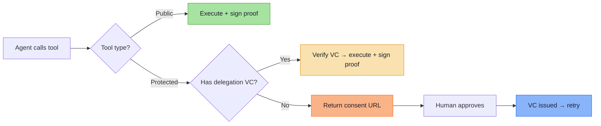

# @mcp-i/core

[](https://github.com/modelcontextprotocol-identity/mcp-i-core/actions/workflows/ci.yml)
[](https://www.npmjs.com/package/@mcp-i/core)
[](./LICENSE)
[](https://nodejs.org)
[](https://www.typescriptlang.org)

The missing trust layer for MCP. Convert any MCP server into an identity-aware, cryptographically verifiable endpoint — two lines of code, zero central authority.

```typescript
import { McpServer } from "@modelcontextprotocol/sdk/server/mcp.js";
import { withMCPI, NodeCryptoProvider } from "@mcp-i/core";

const server = new McpServer({ name: "my-server", version: "1.0.0" });
await withMCPI(server, { crypto: new NodeCryptoProvider() });
```

Your server now has a DID identity, mutual handshake, signed proofs on every response, and optional human-in-the-loop delegation for sensitive tools.

## Install

```bash
npm install @mcp-i/core
```

## What it does

- **Identity** — both sides get `did:key` identifiers (Ed25519). No registration, no central directory.
- **Proofs** — every tool response includes a detached JWS. Callers can independently verify nothing was tampered with.
- **Delegation** — sensitive tools require a W3C Verifiable Credential scoped, time-limited, and signed by a human approver.
- **Sessions** — nonce-based handshake with replay prevention and configurable TTL.

> [!NOTE]
> **Open standard.** MCP-I is governed by the [DIF Trusted AI Agents Working Group](https://identity.foundation/working-groups/agent-and-authorization.html). Full spec: [modelcontextprotocol-identity.io](https://modelcontextprotocol-identity.io/introduction)

## Try it

Run the consent flow end-to-end:

```bash
git clone https://github.com/modelcontextprotocol-identity/mcp-i-core.git
cd mcp-i-core && pnpm install
npx tsx examples/consent-basic/src/server.ts
```

In a second terminal, connect with [MCP Inspector](https://github.com/modelcontextprotocol/inspector):

```bash
npx @modelcontextprotocol/inspector
# Connect to http://localhost:3002/sse
```

Call `checkout`. Get a consent link back. Approve it. Retry the tool. That's the full delegation flow.

<p align="center">
  
</p>

## Architecture



## Documentation

| Topic | Where |
|-------|-------|
| Module deep-dive (middleware, delegation, proof, session, auth, providers) | [`src/README.md`](./src/README.md) |
| JSON Schema definitions | [`schemas/README.md`](./schemas/README.md) |
| Conformance levels | [`CONFORMANCE.md`](./CONFORMANCE.md) |
| Full protocol spec | [`SPEC.md`](./SPEC.md) |
| Changelog | [`CHANGELOG.md`](./CHANGELOG.md) |

## Examples

| Example | Description |
|---------|-------------|
| [consent-basic](./examples/consent-basic/) | Human-in-the-loop consent flow with SSE + Streamable HTTP |
| [consent-full](./examples/consent-full/) | Production consent UI via [`@kya-os/consent`](https://www.npmjs.com/package/@kya-os/consent) |
| [brave-search-mcp-server](./examples/brave-search-mcp-server/) | Real-world Brave Search server with MCP-I proofs |
| [context7-with-mcpi](./examples/context7-with-mcpi/) | Adding MCP-I to a third-party MCP server |
| [outbound-delegation](./examples/outbound-delegation/) | Forwarding delegation to downstream services |
| [verify-proof](./examples/verify-proof/) | Standalone proof verification |
| [statuslist](./examples/statuslist/) | StatusList2021 credential revocation |
| [node-server](./examples/node-server/) | Low-level Server API with handshake + restricted tools |

## Extension points

Every crypto operation, storage backend, and identity resolver is abstracted behind interfaces:

```typescript
// Use AWS KMS instead of local keys
class KMSCryptoProvider extends CryptoProvider { /* ... */ }
await withMCPI(server, { crypto: new KMSCryptoProvider() });
```

DID methods (`did:key`, `did:web`, custom), storage (in-memory, Redis, Postgres), and nonce caches are all pluggable. See [`src/README.md`](./src/README.md) for details.

## Requirements

- **Node.js 20+**
- **Runtime deps:** [jose](https://github.com/panva/jose), [json-canonicalize](https://www.npmjs.com/package/json-canonicalize)
- **Peer dep:** `@modelcontextprotocol/sdk` (optional, only for `withMCPI`)

## Contributing

See [CONTRIBUTING.md](./CONTRIBUTING.md). DCO sign-off required.

## Governance

See [GOVERNANCE.md](./GOVERNANCE.md). Lazy consensus for non-breaking. Explicit vote for breaking.

## Security

See [SECURITY.md](./SECURITY.md). 48h ack. 90-day coordinated disclosure.

## License

MIT — see [LICENSE](./LICENSE)
