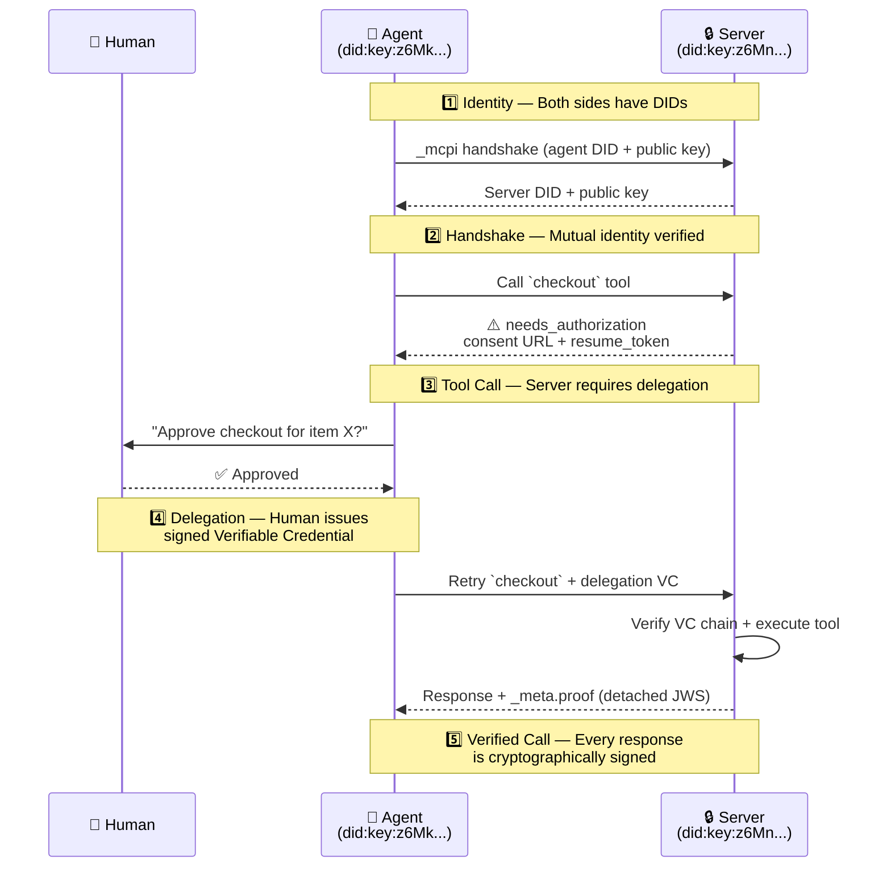

# Visual 3: Sequence Diagram

Copy this Mermaid block into your docs page under "What's Happening Under the Hood".

```mermaid
sequenceDiagram
    participant H as 👤 Human
    participant A as 🤖 Agent<br/>(did:key:z6Mk...)
    participant S as 🔒 Server<br/>(did:key:z6Mn...)

    Note over A,S: 1️⃣ Identity — Both sides have DIDs

    A->>S: _mcpi handshake (agent DID + public key)
    S-->>A: Server DID + public key
    Note over A,S: 2️⃣ Handshake — Mutual identity verified

    A->>S: Call `checkout` tool
    S-->>A: ⚠️ needs_authorization<br/>consent URL + resume_token
    Note over A,S: 3️⃣ Tool Call — Server requires delegation

    A->>H: "Approve checkout for item X?"
    H-->>A: ✅ Approved
    Note over H,A: 4️⃣ Delegation — Human issues<br/>signed Verifiable Credential

    A->>S: Retry `checkout` + delegation VC
    S->>S: Verify VC chain + execute tool
    S-->>A: Response + _meta.proof (detached JWS)
    Note over A,S: 5️⃣ Verified Call — Every response<br/>is cryptographically signed
```
