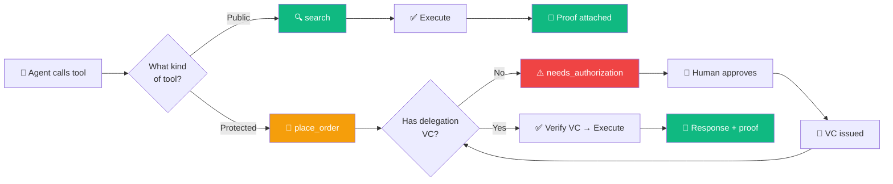

# Visual 6: Tool Protection Flow

Copy this Mermaid block into your docs page under "Protect Specific Tools".

```mermaid
flowchart LR
    A["🤖 Agent calls tool"] --> B{"What kind<br/>of tool?"}

    B -->|"Public"| C["🔍 search"]
    C --> D["✅ Execute"]
    D --> E["📝 Proof attached"]

    B -->|"Protected"| F["🛒 place_order"]
    F --> G{"Has delegation<br/>VC?"}

    G -->|"No"| H["⚠️ needs_authorization"]
    H --> I["👤 Human approves"]
    I --> J["📜 VC issued"]
    J --> G

    G -->|"Yes"| K["✅ Verify VC → Execute"]
    K --> L["📝 Response + proof"]

    style C fill:#10b981,color:#fff
    style F fill:#f59e0b,color:#fff
    style H fill:#ef4444,color:#fff
    style E fill:#10b981,color:#fff
    style L fill:#10b981,color:#fff
```
