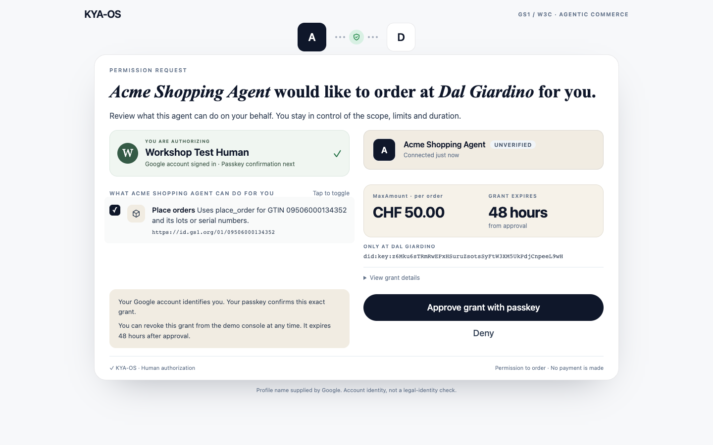

# From agent-visible to agent-actionable

A human grants a shopping agent authority to place an order for one GS1 Digital Link product class.
The merchant verifies the grant, the agent's holder key, the CHF cap and the current revocation list before accepting the order.
The Responsible Party can withdraw that authority mid-session.
The signed, witnessed Merkle bundle records consent, issuance, allowed action, revocation and denial.

Built for the GS1/W3C workshop **Ecommerce for Humans and AI Agents**, Zurich, 9 September 2026.
Talk: **From Agent-Visible to Agent-Actionable: KYA-OS, a Rail-Agnostic Trust Layer for E-commerce**.
This demonstration places orders; it does not move money or integrate a payment rail.

## Start here

Requires Python 3 and Node.js 20.19+, 22.12+, or 24+.
The consent UI is installed from the public npm registry as `@kya-os/consent@0.1.48`.
Keep the committed `package-lock.json`: it fixes the dependency graph for ordinary `npm install` and CI's `npm ci`.
Resolving without it can trigger npm 10's circular peer-dependency resolver bug.
Install dependencies before the workshop; the default demonstration runs on localhost without conference Wi-Fi.
Claude needs its own network connection, so keep the scripted fallback ready.

```bash
cd examples/agentic-commerce
npm install
npm run setup
npm run demo
```

Project [the merchant console](http://localhost:4949/).
The Responsible Party hub runs on port **4950**; the merchant runs on **4949**.
Open [Connect Claude](http://localhost:4949/connect) for the HTTP endpoint and connection instructions.
`npm run demo` also starts the shopping agent gateway at **`http://localhost:4949/agent/mcp`**.
Setup writes identity keys, DID documents, the status list and a reserved index, with **no active DelegationCredential**.
Do not run the low-level `npm run issue` fixture utility for the live flow.

Press `1` to request two risotto, **CHF 39.80**.
The merchant returns `needs_authorization`, and the console displays **Open human consent** with the actual authorization URL.
Open it, inspect the package-rendered consent page and click **Approve grant**.
Return to the console and press `4` to retry the same order.
The order is authorized.
Press `K` to revoke, then `4` again to see the denial.

Cold restart, including setup and both services:

```bash
npm run demo:restart
```

Stop the previous demo with `Ctrl+C` first.
This command checks for occupied demo ports before changing state, prepares a fresh run, then starts both services.
`R` on the console clears the active grant and pending consent sessions without restarting the services.
It never issues a replacement grant; the next request needs human approval.
Restart the process for a clean in-memory audit ledger.
If using Google, sign in after the final restart: Google sessions and pending logins are intentionally in memory; account references and registered keys persist.

## Dylan's four-minute run of show: nine beats

Complete dependency installation and Claude configuration before the audience arrives.
Keep one terminal at this example directory, the merchant console and Claude Code connected over HTTP ready.
Default spoken path: **click-wrap issue → status-list revoke**.

| Beat | Time | Exact action | What the audience sees |
|---|---|---|---|
| 1 | 0:00 | `npm run setup && npm run demo` | Merchant `:4949`, RP `:4950`, no active grant. |
| 2 | 0:20 | Connect Claude Code to `http://localhost:4949/agent/mcp` using the command below; project `http://localhost:4949/`; press `P`. | The merchant verifier console and HTTP shopping tools. |
| 3 | 0:35 | Send the pinned Claude prompt below. | `place_order` reaches the merchant before a grant exists. |
| 4 | 1:00 | Open **Open human consent** on the console, or Claude's verified `authorizationUrl`. | Signed `needs_authorization`, then the real `@kya-os/consent` UI. |
| 5 | 1:25 | Point out GTIN, MaxAmount CHF 50.00, audience and Responsible Party; click **Approve grant**. | Human approval issues the scoped credential. |
| 6 | 2:00 | Return to Claude: **Retry the exact same place_order with the same product and quantity.** | Two risotto, CHF 39.80, authorized with a signed receipt. |
| 7 | 2:30 | `npm run revoke` | The RP flips the active grant's status-list bit and publishes a newly signed list. |
| 8 | 2:50 | In Claude: **Retry the exact same place_order again.** | Revoked denial; the agent still holds its key and credential. |
| 9 | 3:15 | On the console press `E`, then run `npm run verify:ledger` and `npm run verify:ledger:py`. | Consent → delegation → allow → revoke → deny, with a verified honest Merkle bundle. |

Pinned Claude prompt, with exact tool, GTIN, URI, quantity and cap:

> Using only the connected `place_order` tool, place an order for exactly 2 risotto of GTIN `09506000134352`, product `https://id.gs1.org/01/09506000134352`, quantity `2`, total CHF 39.80, within a MaxAmount of CHF 50.00 per order. Do not pay. Do not browse the web or use another tool. If the merchant returns `needs_authorization`, show the authorizationUrl and stop until I approve the grant and ask you to retry. Retry with the exact same product and quantity.

Say: “The human grants authority for this product class, to this merchant, up to this amount, until this time.”
After revocation: “The agent still has its key; its authority has been withdrawn.”
For the audit: “The evidence includes the human decision and what the merchant actually allowed or refused.”
If there is time, press `T` to show that an insider edit fails verification even after the forged entry is re-signed.

The consent page's primary action is **Approve grant**, its secondary action is **Deny**.
Deny consumes that pending consent decision and issues no credential.
A subsequent new request may ask for a new decision; a replay of the denied decision remains refused.

## Deterministic fallback, with the same human approval

Start the demo as above, then in another terminal:

```bash
npm run demo:scripted
```

This is a real MCP client using the same `runAgentOrder` path as the gateway.
It reads discovery and the catalog, clears any active demo grant, calls `place_order`, prints the verified consent URL and **waits for the human**.
Open that URL on the projector and click **Approve grant**.
The script retries the same two-risotto order, independently verifies the receipt, revokes the grant, checks the next order is denied, exports the bundle and verifies that the honest bundle passes while the tampered one fails.
The script exits nonzero if any required step disagrees.
It never auto-approves a grant.
`DEMO_APPROVAL_TIMEOUT_SECONDS` defaults to 600; the merchant challenge's earlier expiry still applies.

The console buttons are another deterministic MCP client:

| Key | Action |
|---|---|
| `0` | Read merchant discovery and accepted trust schemes. |
| `1` | Request two risotto, CHF 39.80; first request needs consent. |
| `4` | Retry the same two-risotto order. |
| `2` | Wrong product: olive oil, `PRODUCT_OUT_OF_SCOPE`. |
| `3` | Five risotto, CHF 99.50, `SPEND_CAP_EXCEEDED`. |
| `5` | Present the real credential with a thief's key, `holder_binding_failed`. |
| `K` | Revoke the active grant on the RP status list. |
| `V` | Verify the last allowed receipt with independent Python code. |
| `A` | Anchor and witness the audit ledger. |
| `T` | Attempt an insider edit against the witnessed ledger. |
| `E` | Export honest and tampered bundles and verification reports. |
| `R` | Clear the active grant; require fresh human consent. |
| `P` / `C` | Presenter mode / higher contrast. |
| `Esc` | Close the audit overlay. |

Presenter mode hides controls but keeps keyboard shortcuts and the consent link active.
Rehearse at the projector's resolution.

## Connect Claude over Streamable HTTP

Both MCP endpoints use stateless Streamable HTTP and start with `npm run demo`.

| Endpoint | Purpose |
|---|---|
| `http://localhost:4949/agent/mcp` | Connect Claude here: **browse_catalog** and **place_order**, with the gateway holding the shopping agent's key and grant. |
| `http://localhost:4949/mcp` | The protected merchant MCP server: **get_catalog** and **place_order**, requiring the agent's holder proof for an order or consent challenge. |
| `http://localhost:4950/` | The Responsible Party's human consent, passkey and revocation hub; this is not an MCP endpoint. |

For local rehearsal, run this from the directory where you will start Claude Code:

```bash
claude mcp add --transport http --scope local kya-shopping-agent http://localhost:4949/agent/mcp
claude mcp get kya-shopping-agent
claude
```

In Claude Code, use `/mcp` to inspect the connection and available tools, then send the pinned prompt above.
If a previous entry with this name launches a local process, remove it with `claude mcp remove kya-shopping-agent --scope local` before adding the HTTP entry.
The equivalent JSON is [docs/claude-code.mcp.json](docs/claude-code.mcp.json); merge its entry into a project `.mcp.json` only if you prefer shared project configuration.
See [Claude Code's HTTP configuration documentation](https://code.claude.com/docs/en/mcp#option-1-add-a-remote-http-server).

Claude Desktop and Claude web **Custom connectors** use a reachable HTTPS server URL.
Their connector requests originate from Anthropic's cloud even when the Desktop app is running on this laptop, so these localhost URLs cannot be used there directly.
See [Anthropic's connector networking guidance](https://support.claude.com/en/articles/11176164-use-connectors-to-extend-claude-s-capabilities) and [custom connector setup](https://claude.com/docs/connectors/custom/remote-mcp).
This example has not been deployed publicly.
A hosted rehearsal needs an authenticated gateway and correctly configured public consent origins; the presenter console's local reset and revocation controls must remain private.
The existing `docs/claude_desktop_config.json` is a legacy stdio configuration and is not used for this HTTP flow.

The gateway is the agent's trusted signing runtime.
Claude supplies product and quantity; the gateway adds the agent's credential and fresh proof before calling the protected merchant at `/mcp`.
Connecting a generic Claude client directly to the merchant does not supply those proofs.
The merchant enforces delegation using the published `@kya-os/mcp` package; the Model Context Protocol SDK supplies the HTTP transport.
The agent requires `MERCHANT_DID`; setup writes it to `.env.local`, which the demo loads.

The gateway signs each tool request with the agent's private key, verifies the merchant's response proof before exposing the authorization URL, and remembers the pending resume token.
The approved credential is reloaded from the shared agent store on the next call.
For the first retry, the gateway attaches the new credential, the matching resume token and a fresh holder-of-key proof.
That first order may use any quantity or product instance within the approved product class and per-order cap; it need not repeat the order that triggered consent.
Out-of-scope or over-cap attempts are refused before consuming the token.
Private keys and proof arguments are kept out of the model's tool arguments and projector output.
The projector deliberately displays the authorization URL, including its one-use resume token, so the human can open consent.

**Stateless refers to the MCP transport:** each HTTP request is handled independently, with no `Mcp-Session-Id` or remembered MCP protocol session required.
The agent's reusable key and delegation, the RP's consent records and the revocation list remain application state.
Every protected request carries its own fresh holder proof, and the merchant checks the current revocation status each time.
The gateway represents the single configured workshop agent; it is not a shared multi-user agent service.

## What the grant contains

| Property | Demo value |
|---|---|
| Credential type | `DelegationCredential`, with the existing issuance shape. |
| Issuer | Responsible Party `did:web:localhost%3A4950`. |
| Subject / invoker | The shopping agent's `did:key`. |
| Action | `place_order`, delegated under `commerce.order`. |
| Product class | `https://id.gs1.org/01/09506000134352`, GTIN `09506000134352`. |
| Scope matcher | CRISP `prefix`, plus the existing GS1 path-boundary check. |
| MaxAmount | Existing constraint `maxAmount: "50.00"`, `currency: "CHF"`, `per: "order"`. |
| Audience | The merchant's DID, shown on the consent page. |
| Window | `VALID_HOURS=48`; the page shows the duration from approval, when the credential's expiry is set. |
| Revocation | `StatusList2021Entry` at the RP-hosted list and the issued grant's assigned index. |

`SCOPE_PRODUCT_CLASS`, `SPEND_CAP`, `SPEND_CURRENCY` and `VALID_HOURS` configure these existing constraints.
Use the defaults for the pinned workshop prompt.
The permission checkbox must remain selected to approve this single-scope grant.
The RP validates the selected scope against the requested grant, persists it in the consent record and audit commitment, and uses that same scope when minting the credential.
Passkey confirmation binds the selected scopes too; an empty, substituted or changed selection cannot issue a grant.
No new Entity Card fields or product models are introduced.

## Optional passkey or DEF CON badge

`CONSENT_WEBAUTHN=0` is the default click-wrap consent path, independent of `KEY_WEBAUTHN=0` for revocation.
Hardware is not required for the nine spoken beats.
`CONSENT_WEBAUTHN=1` enables the optional issuance ceremony using the RP's existing WebAuthn stack.
The assertion is bound to an issuance intent containing the agent, scopes, cap, resume token and nonce.
When enabled with a registered authenticator, issuing the grant requires the valid assertion; the consent audit records the authenticator identity.

Register an authenticator through the existing setup UI before trying the hardware path:

```bash
KEY_SETUP=1 npm run demo
# Open http://localhost:4949/setup-key.html and register a FIDO2 authenticator.
# Stop the demo, then:
CONSENT_WEBAUTHN=1 npm run demo
```

A compatible FIDO2 conference badge, YubiKey or platform passkey can perform that ceremony.
Use the exact configured WebAuthn origin; `localhost` and `127.0.0.1` are different origins.
The consent integration handles its configured origin separately from the existing revocation origin.
If no authenticator is registered, the page offers registration and preserves the default click-wrap fallback.
Switch back to `CONSENT_WEBAUTHN=0` for the spoken run if the laptop or badge is unreliable.

`KEY_WEBAUTHN=1` independently enables the existing touch-to-revoke ceremony.
`DEMO_BYPASS_WEBAUTHN=1` remains the existing revocation bypass.
Do not require both ceremonies during the four-minute talk.
The browser regression `npm run test:webauthn:browser` uses Chromium's virtual authenticator to exercise real registration, issuance assertion verification, order, software revoke and denial without physical hardware.
It uses the same Playwright and `CHROMIUM` prerequisites as the capture script.

## Show the human behind the agent

The optional Google account path links a signed-in account to its registered passkey and the exact agent grant.
The passkey itself does not supply a name or email.
Google supplies account claims; the RP verifies the identity token and binds registration to that account.
The displayed name is provider-supplied account data, not a verified legal identity.

Create a Google OAuth client of type **Web application**.
Add both `http://localhost` and `http://localhost:4950` as **Authorized JavaScript origins**.
This integration uses the Google Identity Services JavaScript callback, so no client secret or redirect URI is needed.
See [Google's setup guide](https://developers.google.com/identity/gsi/web/guides/get-google-api-clientid).

Set the public client ID in this example's `.env.local`, preserving its existing keys:

```dotenv
GOOGLE_CLIENT_ID=your-client-id.apps.googleusercontent.com
```

Stop the running demo, then:

```bash
KEY_SETUP=1 CONSENT_WEBAUTHN=1 npm run demo
```

Open `http://localhost:4950/setup-key.html` in Chrome, sign in with Google and register a passkey.
On the merchant console, press `R`, then `1`, open consent and approve with that passkey.
The grant panel shows **Google account → passkey approval → consent → agent**, along with the original GS1 scope and CHF cap.
Google sign-in requires connectivity; the original local click-wrap flow and recorded backup remain available with `GOOGLE_CLIENT_ID` unset.

Configuring Google requires both a valid account session and that account's passkey for issuance, even if `CONSENT_WEBAUTHN` is off.
An anonymous or different account's registered authenticator cannot approve the named grant.
Keys registered before Google sign-in remain anonymous and need fresh account-bound registration.
Google sessions expire and end when the RP process restarts; the account references and registered keys persist.

The existing signed credential metadata contains `demoConsent`: an opaque account reference, Google issuer and display name, consent reference, passkey reference, approval time and issuance-intent hash.
The same snapshot is committed by the consent audit events.
The raw Google subject, email, identity token and access tokens are excluded from this signed public metadata.
The RP remains the credential issuer and the shopping agent remains its subject.
Neither the name nor the device label is used to make authorization decisions.

The client ID must be configured before testing actual Google sign-in.
Automated identity tests use locally signed test tokens with Google's real verifier; those tests do not claim a live Google account login.
With the browser prerequisites below installed, `npm run test:google:browser` runs that isolated account session through actual passkey registration, consent, the named projector grant, order, revocation and audit verification.
It writes `docs/screenshots/google-identity/google-identity-browser-report.json` and screenshots.
The test issuer and certificate substitution exist only in the isolated browser fixture, never in the live demo routes.

## Evidence and verification

```bash
npm test
npm run typecheck
npm run demo:e2e
```

The end-to-end suite uses ephemeral ports and no model.
It covers a fresh agent, proof-bound authorization URL, real consent HTML, selected-scope persistence, denial, issuance, grant-bound first use, independent receipt verification, wrong GTIN, cap, revoked status, expired and mismatched consent, and the audit export and tamper checks.
The existing product boundary, resolver fail-closed and holder-binding checks remain in place.
The seven projector gates distinguish signature, holder, consent, scope, cap, revocation and order decisions.
The projector tests execute the page's actual SSE handlers for absent grants, safe consent links, approval, denial and reset.

After the live flow, press `E` to write the replay bundles to `var/audit/`, then:

```bash
npm run verify:ledger
npm run verify:ledger:py
npm run verify:ledger:tampered
```

The honest bundle must exit **0**.
The tampered bundle must exit **1** with integrity failures; that deliberate rejection is the expected result.
The SDK verifier reports separate dimensions for signatures, chain, checkpoint, witness and authorization evidence.
An `indeterminate` evidence dimension is distinct from an invalid signature or Merkle proof.
The in-memory journal advertises AAP-1, as enforced by the SDK; the witness is real, but it does not turn this demo into a durable journal.
The existing audit implementation, status-list resolver, GS1 policy and verifier scripts remain the source of truth.

## Recorded fallback and browser rehearsal

Install browser capture dependencies before the event:

```bash
python3 -m pip install playwright
python3 -m playwright install chromium
```

With the default click-wrap demo running:

```bash
npm run demo:capture
# Equivalent:
python3 scripts/screenshot-run.py docs/screenshots/consent --presenter --record-video --duration 90
```

The driver clicks the actual consent component's **Deny** and **Approve grant** buttons, verifies visible GTIN, URI, MaxAmount, currency and audience, then checks the allowed order, scope/cap refusals, revocation and ledger tamper rejection.
It writes screenshots, `consent-browser-report.json` and a minimum 90-second `consent-demo-backup.webm` into `docs/screenshots/consent/`.
Play the local recording if Claude or the venue connection fails.
Set `CHROMIUM` to a local Chrome executable if Chromium is installed outside Playwright's default location.
For a quick rehearsal without video, omit `--record-video`.
Add `--check-variants` to submit both native no-JavaScript consent forms and check the mobile layout at 390 pixels wide.
The valid consent URL is fetched before the approval screenshot, so the first projected paint contains the grant rather than a loading skeleton.

## Workshop screenshots and backup

These screenshots use the published `@kya-os/consent@0.1.48` package.
“Workshop Test Human” is a fictional account in the isolated acceptance fixture; Chromium's virtual authenticator performs the WebAuthn registration and assertion.



- [Account-bound passkey registration](docs/screenshots/0.1.48/passkey-registered.png)
- [The signed human-to-agent relationship on the projector](docs/screenshots/0.1.48/human-to-agent-projector.png)
- [90-second click-wrap demonstration backup](docs/screenshots/consent/consent-demo-backup.webm)

## Implementation boundaries

The merchant uses published `createKyaOsMiddleware` with `holderBinding: 'enforce'` and the existing HTTP status-list resolver.
After credential verification, the original merchant handler applies the GS1 prefix/path-boundary and per-order cap decisions.
Every protected call receives a fresh status-list observation; an unreadable or untrusted list fails closed.
`acceptedTrustSchemes` remains the demo's discovery proposal; the GS1 resource remains a profile of the existing CRISP scope.
The localhost issuer is already the Responsible Party, so the human's explicit button approval is sufficient for this demonstration's trust boundary.

The response proof for `needs_authorization` binds the whole challenge body, including `authorizationUrl`.
The RP confirms the pending session, agent, scopes, merchant audience and expiry before issuing through `issueDelegation` / `issueAndActivate`.
The issuer uses `DelegationCredentialIssuer.createAndIssueDelegation` without inventing a different credential shape.
The agent store is `var/active-index.json` plus `var/delegation-<index>.json`.
A denied, expired, modified or reused consent decision cannot issue a new grant.

For local or offline rehearsal the default RP DID resolves to this laptop.
`ALLOW_INSECURE_LOCALHOST=1` permits the existing loopback-only HTTPS-to-HTTP rewrite; unrelated hosts are not downgraded.
`OFFLINE=1` resolves the RP DID document through the hub mirror while still verifying signatures.
`AUDIT_WITNESS=0` disables witnessing for diagnostic runs; leave it enabled for the workshop.


## Published consent package

This example pins `@kya-os/consent` to the published **0.1.48** release, which includes the reviewed scope-selection behavior and human identity and grant-detail slots from [PR #726](https://github.com/modelcontextprotocol-identity/xmcp-i/pull/726).
The normal `npm install` command installs the complete browser bundle and its dependencies directly from npm.
The host validates the selected scopes and passkey assertion before issuing the grant; the package supplies the consent controls and layout.

Use `npm run test:google:browser` and `npm run test:webauthn:browser` to verify the actual consent component with the named account and default RP flows.
